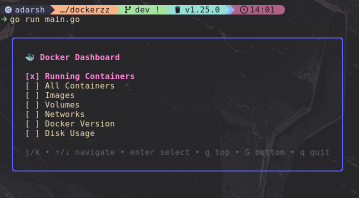
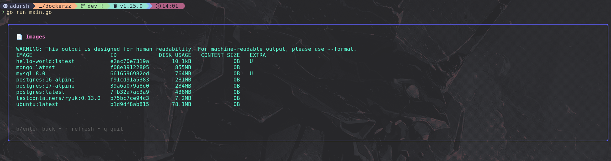
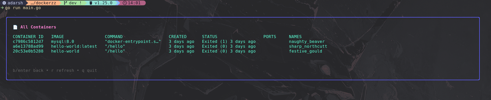

# 🐳 Simple Docker TUI

> VIBE CODED BTW... idk how to use Bubble Tea, I know Docker tho.

A lightweight Terminal User Interface (TUI) built with Go for quickly viewing Docker resources directly from the terminal.

---

## Features

- View running containers
- View all containers
- View Docker images
- View Docker volumes
- View Docker networks
- View Docker version
- View Docker disk usage
- Refresh current view
- Keyboard-only navigation
- Clean terminal UI using Bubble Tea + Lipgloss

---

## Keybindings

| Key     | Action               |
| ------- | -------------------- |
| `j / ↓` | Move down            |
| `k / ↑` | Move up              |
| `enter` | Select option        |
| `b`     | Go back              |
| `r`     | Refresh current view |
| `g`     | Jump to top          |
| `G`     | Jump to bottom       |
| `q`     | Quit                 |

---

## Tech Stack

- Go
- Bubble Tea
- Lipgloss
- Docker CLI

---

## Screenshot





```bash
🐳 Docker Dashboard

[x] Running Containers
[ ] All Containers
[ ] Images
[ ] Volumes
[ ] Networks
[ ] Docker Version
[ ] Disk Usage
```

---

## Run Locally

```bash
git clone <repo-url>

cd <repo>

go mod tidy

go run main.go
```

---

## Requirements

- Go installed
- Docker installed and running
